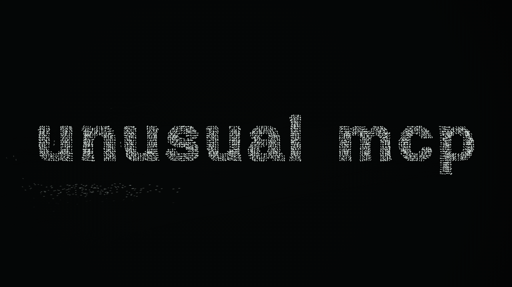

# Live Steel

Particle-letter "living metal" typography. A Rust→WASM kernel (~2.6k lines, zero
dependencies) drives up to 4096 magnetized rod particles through a glyph-derived
energy field; words assemble as a side effect of field physics, not pixel
teleportation. The whole thing ships as **one self-contained 258 KB HTML file**.



## Run it

Open `mf_proto_live_steel.html` in a browser. That's it — WASM kernel and font
are embedded.

For interactive text and parameter work, open `live_steel_panel.html` next to the
standalone. The panel is a separate workshop shell: it can rebuild text fields,
edit per-letter layout, save presets, and export PNGs without modifying canonical
proof evidence. See `README_PANEL.md`.

## Build from source

```bash
rustup toolchain install        # pins rustc 1.95.0 via rust-toolchain.toml
python3 build.py                # cargo build (wasm32) + embed into standalone HTML
cargo test --release            # 10 kernel unit tests
```

The build is fail-closed: missing bundled font or lockfiles abort it. Output is
byte-deterministic across host OSes (LF-normalized writes, separator-stable
panic paths via `.cargo/config.toml`).

## Verify the release

Every clean clone must pass its own evidence bundle:

```bash
python3 verify_artifact.py --root . --manifest review_manifest.json --mode release
```

This independently recomputes all hashes (sources, toolchain locks, embedded
WASM and font extracted from the HTML, 21 evidence PNGs) and re-derives the six
proof gates from raw `proof_stats.json` — stored verdicts are never trusted.

## Re-capture the proof

```bash
npm ci
npx playwright install chromium
node capture_live_steel_proof.js --html=mf_proto_live_steel.html \
  --out=review_pack --manifest=review_manifest.json --release-browser
```

`--release-browser` forces the Playwright-managed pinned Chromium; system
browsers are non-release by design. Gates: determinism (same-host repeat),
no page errors, dense strokes, readable metal typography, temporal life,
morph continuity, sim-only perf p95 ≤ 10 ms/step (measured ~5.4 ms).

## Layout

- `src/lib.rs` — WASM kernel (sim, fields, chain/pair forces, state machine)
- `template.html` — renderer + audit hooks; `build.py` embeds WASM/font into it
- `proof/` + `proof_stats.json` — hash-pinned capture evidence
- `causal_audit.json` + `tools/audit_causal_letters.cjs` — deep causality audit
- `gate_config.json` — versioned gate thresholds
- `CANON.md` — canonical host definition, identity ladder, open items
- `live_steel_panel.html` + `tools/smoke_live_steel_panel.cjs` — interactive
  workshop and machine smoke verifier

## Status

Release chain (build → capture → verify) is green on the canonical recipe.
Known-red: 9 shape-IoU checks in the causal audit are calibrated on Windows
rasterization and dip under threshold on Linux — documented, not tuned away.
See `CANON.md` §5.

## License

Font: OFL 1.1 (`FONT_LICENSE.md`). Code: license not yet declared.
